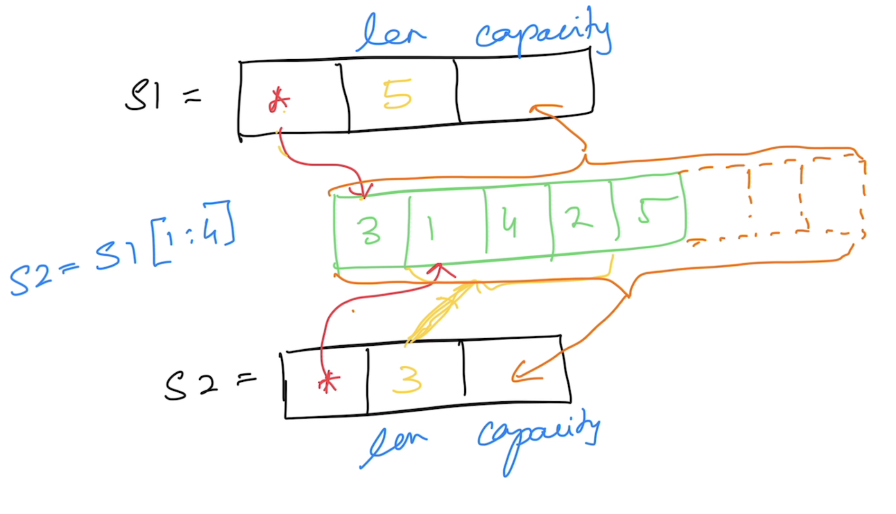

# Go Foundation

## Magesh Kuppan
- tkmagesh77@gmail.com

## Schedule
| What | When |
|----|----|
| Commence | 9:00 AM |
| Tea Break | 10:30 AM (20 mins) |
| Lunch Break | 12:30 PM (1 hour) |
| Tea Break | 3:00 PM (20 mins)
| Wind Up | 5:00 PM |


## Repository
- https://github.com/tkmagesh/cisco-gofoundation-jun-2025
## Methodology
- No powerpoint
- Discuss & Code
- Anytime is good for Q&A

## Software Requirements
- Go Tools (https://go.dev/dl)
    - Verification
    ```shell
    go version
    ```
- Visual Studio Code (Or any other editor)
    - Go Extension for VSCode (https://marketplace.visualstudio.com/items?itemName=golang.Go)


## Why Go?
1. Simplicity
    - ONLY 25 keywords
    - No access modifiers (public, private, protected etc)
    - No reference types (everything is a value)
    - No pointer arithmatic
    - No classes (only structs)
    - No inheritance (only composition)
    - No exceptions (only errors)
    - No "try..catch..finally"
    - No implicit type conversions
2. Performance
    - Close to hardware
        - Compiled to machine code (like C & C++)
        - `Cross compilation` support is enabled in the compiler
    - No need for a VM
        - How is memory managed (where is the GC)?
    - Performance comparable to C++
3. Concurrency Support
    - Concurrent operations are represented as `Goroutines`
    - `Goroutines` are very cheap (2 KB) when compared to OS Threads (~2MB)
    - Support for concurrency is offered `through the language`
        - Language features for concurrency
            - `go` keyword
            - `chan` data type
            - `<-` operator 
            - `range` construct
            - `select-case` construct
    - Standard Library API support
        - `sync` package
        - `sync/atomic` package

## Compilation
```shell
go build [filename.go]
```

## Compile & Execute
```shell
go run [filename.go]
```

## Cross Compilation
### Get the environment variables
```shell
go env
go env [var_1] [var_2] ....
```
### Env variables for cross compilation
- GOOS
- GOARCH

### Get the list of supported platforms
```shell
go tool dist list
```
### To cross compile
```shell
GOOS=windows GOARCH=amd64 go build 01-hello-world.go
```

## Data Types
- string
- bool
- integers
    - int8
    - int16
    - int32
    - int64
    - int
- unsigned integers
    - uint8
    - uint16
    - uint32
    - uint64
    - uint
- floating points
    - float32
    - float64
- complex
    - complex64 ( real[float32] + imaginary[float32] )
    - complex128 ( real[float64] + imaginary[float64] )
- alias
    - byte (alias for unsigned int)
    - rune (alias for unicode code point)

### Zero values
| Data Type | Zero value |
------------ | ------------- |
|int family     | 0 |
|uint family    | 0 |
|complex family | (0+0i) |
|string         | "" (empty string) |
|bool           | false |
|byte           | 0 |
|interface      | nil |
|pointer        | nil |
|function       | nil |
|struct         | struct instance |

## Variables
### Function Scope
- Can use ":="
- CANNOT have unused variables

### Package Scope
- Cannot use ":="
- CAN have unused variables

## IOTA
- values for a `group` of constants can be auto-generated

## Functions
- Can return more than one result
- Variadic functions
- Anonymous functions
    - Cannot have a name
    - Must be immediately invoked
- Higher Order Functions (functions as `data`)
    - Assign functions as values to variables
    - Pass functions as arguments
    - Return functions as return values
- Deferred functions

## Collections
### Array
- Fixed sized typed collection
### Slice
- Varying sized typed collection
- `append()` to add new items
- `len()` to get the # of items in the slice
- **IMPORTANT** : A slice is a `pointer` to an underlying array

- `copy()` to create a copy of the slice with the data
- `cap()` to get the overall memory allocated (initialized + uninitialized) 
### Map
- typed collection of key/value pairs
- has to be initialized with `make()` 
- `delete()` to remove an item

## Error Handling
- An error is just a value in go that is returned from a function
- by practice, an error value should implement `error` interface
- Creating an error
    - `errors.New()`
    - `fmt.Errorf()`
    - custom type that implements `error` interface

## Panic & Recovery
### Panic
- represents the state of the application where the application execution is unable to proceed further
- the application is typically shutdown when a panic occurs
- the application is shutdown after executing the scheduled deferred functions
- use `panic()` to programmatically raise a panic

### Recover
- use `recover()` to recover from a panic

## Modules & Packages
### Module
- Any code that need to versioned & deployed together
- A folder with `go.mod` file

#### go.mod
- manifest file for the module
- contains
    - name of the module
        - good to have the complete repo path
    - go version
    - references to dependent modules (libraries, frameworks etc)

##### Create a go.mod file
```shell
go mod init [module_name]
```

#### To run a module
```shell
go run .
```

#### To build a module
```shell
go build .
```

### Package
- logical grouping of code in a module
- typically just a folder
- All the code in the package folder across 'go' files are considered to be belonging to the package
- Accessibility is determined by the name of the entity
    - private (name starts with lowercase)
    - public (name starts with uppercase)

### Using 3rd party libraries/frameworks/tools
#### To add a reference a dependency

```shell
go get [module]

# example:
go get github.com/fatih/color
```
[code downloaded to `$GOPATH/PKG` folder]

#### To use a CLI built in go
```shell
go install [module]

```
[code downloaded, build and the binary is installed in the `$GOPATH/BIN` folder ]

#### To update the references in th go.mod file based on the usage of the modules
```shell
go mod tidy
```

#### To download the dependencies
```shell
go mod download
```

#### Other useful commands
```shell
go mod graph
```
```shell
go mod why [module_name]
```
```shell
go list -m all
```

### Go mod command reference
- https://go.dev/ref/mod